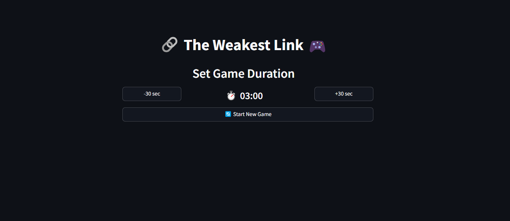
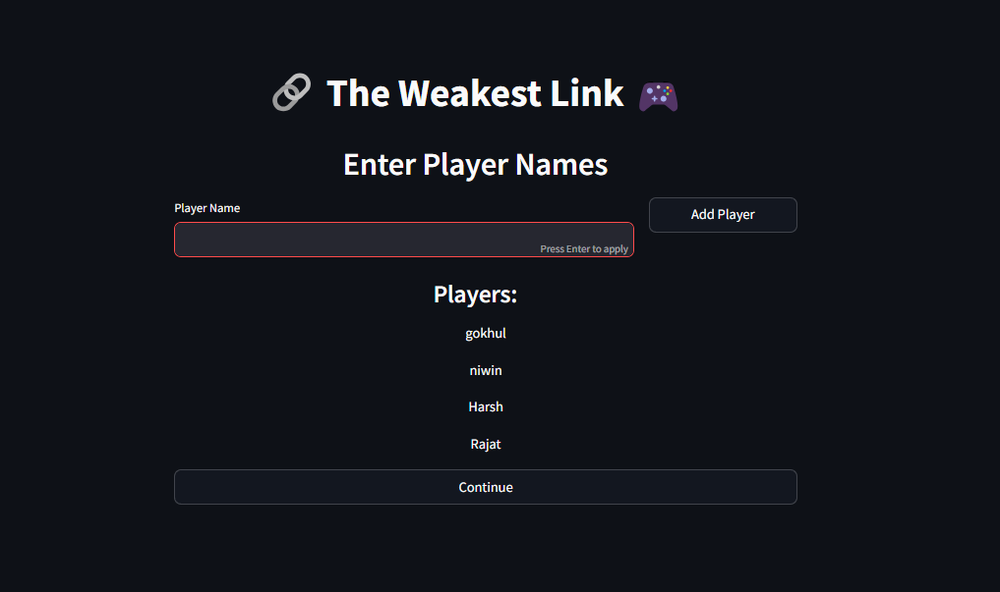
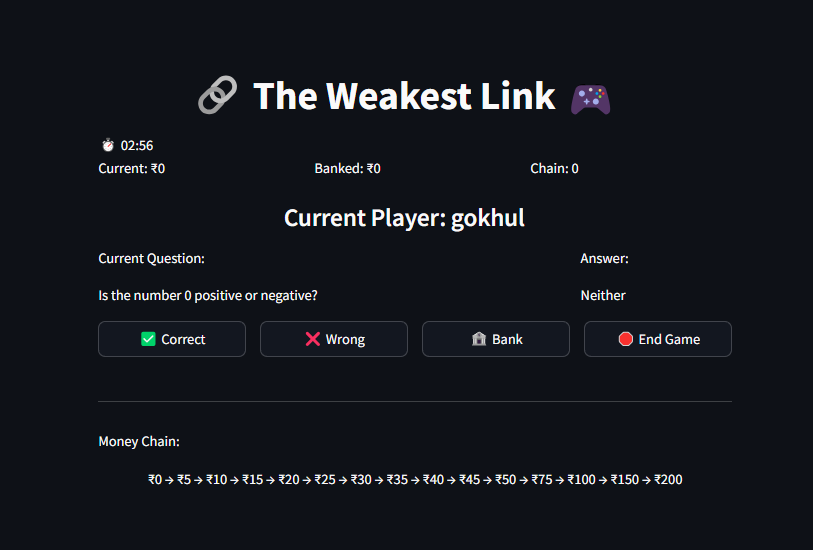
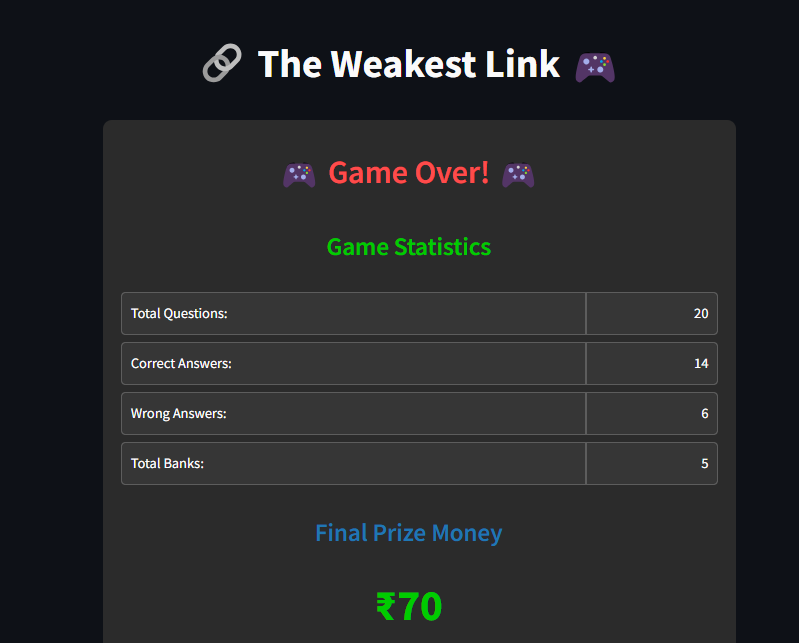
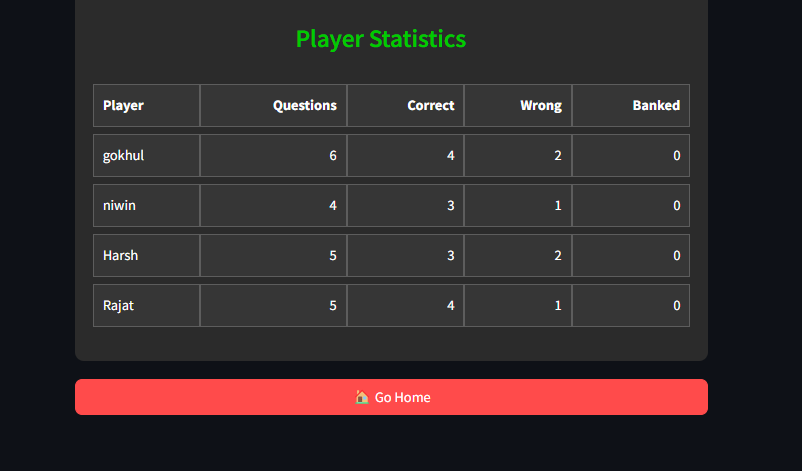

# The Weakest Link Game 🎮

This is a Streamlit-based implementation of "The Weakest Link," a quiz game where players answer questions, bank money, 
and try not to break the chain. Test your knowledge and see if you can become the strongest link!

## Screenshots
### Home Screen


### Add Players


### Gameplay


### Results Page




## Features
- **Player Management**: Add multiple players with individual statistics.
- **Dynamic Question Pool**: A variety of trivia questions to test your knowledge.
- **Money Chain Mechanic**: Build a prize pool by answering questions correctly.
- **Banking System**: Secure your earnings by "banking" at the right time.
- **Timer and Game Management**: Set custom game durations with a live countdown.
- **Statistics Tracking**: View detailed stats for each player at the end of the game.
- **Real-Time Updates**: Instant feedback on answers, banked amounts, and chain progress.
- **Keyboard Controls**:
  - `Q` or `q`: Mark the current answer as correct.
  - `E` or `e`: Mark the current answer as wrong.
  - Spacebar: Bank the current amount.
- **Responsive UI**: Styled components for an immersive experience.
- **Customizable Questions**: Easy to modify the question pool.

## Prerequisites
- Python 3.8 or higher
- Streamlit

## Installation
1. Clone this repository:
   ```bash
   git clone https://github.com/NiwinKumar/Weakest-Link-App.git
   cd Weakest-Link
   ```
2. Install the required dependencies:
   ```bash
   pip install -r requirements.txt
   ```
3. Run the application:
   ```bash
   streamlit run weakest_link_app.py
   ```

## How to Play
1. Set the game duration and start the game.
2. Answer questions by selecting the options for Correct, Wrong, or Bank.
3. Keep an eye on the timer and try to bank the most money.
4. View the game statistics at the end of the game.

## Contributions
Contributions are welcome! Please fork this repository and submit a pull request.

## License
This project is licensed under the MIT License.

Enjoy the game! 🔗🎉
